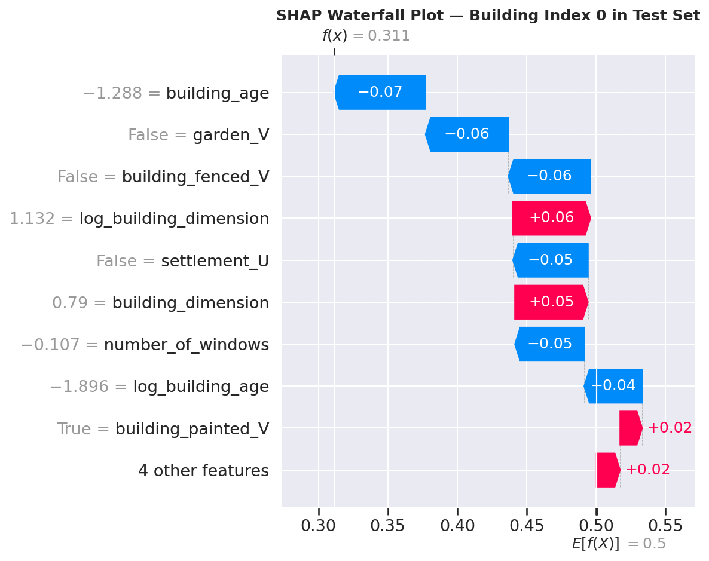

<div align="center">

# 🏛️ Building Insurance Claim Prediction

### An End-to-End Binary Classification Project

[](https://python.org)
[](https://scikit-learn.org)
[](https://streamlit.io)
[](https://jupyter.org)
[](LICENSE)

---

[](https://github.com/cssadewale)
[](https://linkedin.com/in/adewalesamsonadeagbo)

---

### 🏆 Final Capstone Project

**[AI Now Bootcamp](https://www.theincubatorhub.org/programs/ai-now/) · Organised by [The Incubator Hub](https://www.theincubatorhub.org/)**

📅 **9 January 2026, 11:30 AM — 23 January 2026, 12:00 AM**

</div>

---

## 🎓 About the AI Now Bootcamp

This project was submitted as the **final capstone** of the **AI Now Bootcamp**, an intensive artificial intelligence training programme organised by **The Incubator Hub** — a leading African tech ecosystem dedicated to empowering the next generation of tech leaders through hands-on training, mentorship, and innovation.

### About The Incubator Hub

[The Incubator Hub](https://www.theincubatorhub.org/) is a pan-African tech training organisation whose mission is to bridge the digital divide by providing accessible, world-class technology education across the continent. With over **185,000 direct beneficiaries**, presence in **250+ African cities**, and reach across **326+ countries**, the organisation is one of Africa's most impactful tech education ecosystems. Its institutional partners include **Microsoft**, **Google**, **NVIDIA**, and **DataCamp**.

### About the AI Now Programme

The [AI Now programme](https://www.theincubatorhub.org/programs/ai-now/) is The Incubator Hub's flagship artificial intelligence track. It has trained **800+ AI learners**, produced **100+ AI projects**, and reports an **88% employment rate** among graduates. The programme follows a structured three-phase learning path:

| Phase | Focus |
|-------|-------|
| **AI Fundamentals** | Core concepts of artificial intelligence and machine learning |
| **Model Development** | Building, training, and evaluating AI models on real datasets |
| **AI Deployment** | Deploying AI solutions to production environments |

Curriculum pillars include **Machine Learning**, **Deep Learning**, and **AI Ethics**. The programme's stated objectives are to democratise AI education, build practical skills, and promote ethical AI development.

### Capstone Project Context

| Detail | Info |
|--------|------|
| 🎓 **Programme** | AI Now Bootcamp — Final Capstone |
| 🏢 **Organiser** | [The Incubator Hub](https://www.theincubatorhub.org/) |
| 🌐 **Programme Page** | [theincubatorhub.org/programs/ai-now](https://www.theincubatorhub.org/programs/ai-now/) |
| 📅 **Start** | Friday, 9 January 2026 — 11:30 AM |
| 📅 **End** | Friday, 23 January 2026 — 12:00 AM |
| ⏱️ **Duration** | 2-week intensive |
| 🎯 **Role** | Lead Data Analyst |
| 📊 **Domain** | Insurance Risk Analytics / Binary Classification |

---

## 📌 Project Overview

As the **Lead Data Analyst**, the task was to build a predictive model that determines whether a building will have an insurance claim during a given observation period, based on its structural and environmental characteristics.

**Target Variable — `claim`:**

| Value | Meaning |
|-------|---------|
| `1` | The building has **at least one claim** over the insured period |
| `0` | The building has **no claim** over the insured period |

The project covers the complete data science lifecycle — from raw data through systematic cleaning, exploratory analysis, feature engineering, model training, hyperparameter tuning, SHAP interpretability, and a live Streamlit web application deployed to the cloud.

---

## 🗂️ Repository Structure

```
insurance-claim-prediction/
│
├── Insurance_Claim_Prediction.ipynb     ← Full end-to-end notebook (portfolio-ready)
├── app.py                               ← Streamlit web application (3 pages)
├── requirements.txt                     ← App-only Python dependencies
├── runtime.txt                          ← Pins Python 3.11 for Streamlit Cloud
├── README.md                            ← This file
│
└── assets/                              ← All EDA and model visualisations
    ├── target_distribution.png          ← Class balance: 76.82% vs 23.18%
    ├── insured_period_distribution.png
    ├── building_dimension_distribution.png
    ├── number_of_windows_distribution.png
    ├── building_age_distribution.png
    ├── categorical_distributions.png
    ├── correlation_heatmap.png
    ├── numerical_vs_claim.png           ← Box plots split by claim status
    ├── categorical_vs_claim.png
    ├── transformations_before_after.png ← Skewness reduction visualised
    ├── confusion_matrices.png
    ├── roc_curves.png
    ├── precision_recall_curves.png
    ├── feature_importance_rf.png
    ├── shap_summary_dot.png             ← Beeswarm: direction + magnitude per feature
    ├── shap_summary_bar.png             ← Global |SHAP| importance bar chart
    ├── shap_dependence.png              ← Top feature dependence + interaction
    └── shap_waterfall.png              ← Individual building prediction explained
```

> 📦 **Model file:** `best_random_forest_model.joblib` exceeds GitHub's 25 MB file limit and is hosted on Google Drive. The Streamlit app downloads it automatically on first launch via `gdown` — no manual action required.

---

## 🔄 Complete Project Workflow

| Step | Phase | What Was Done |
|------|-------|---------------|
| **1** | Basic Data Exploration | Loaded 7,160 records × 14 columns; standardised all column names (lowercase + underscores); dropped `customer_id` and `geo_code`; corrected 4 data types; cleaned `number_of_windows` in 3 sequential steps (strip whitespace → replace `'.'` with `'0'` → replace `'>=10'` with `'10'` → cast to `int64`); imputed 3 missing-value columns using mode imputation; removed 146 duplicate rows → **7,014 clean records** |
| **2** | Exploratory Data Analysis | Full univariate analysis (target, numerical, categorical); bivariate analysis (Pearson correlations, contingency tables, grouped statistics by claim status); multivariate analysis; automated HTML EDA report via `ydata-profiling`; confirmed 3.3:1 class imbalance; identified `building_dimension` as top predictor; confirmed near-perfect triple redundancy of `building_fenced` / `garden` / `settlement` |
| **3** | Feature Engineering | Engineered `building_age` from datetime subtraction; applied `log1p` transformation to `building_dimension` and `building_age`; applied reflected `log1p` to `insured_period`; dropped 4 redundant date-derived columns; one-hot encoded 4 categorical features (`drop_first=True`) |
| **4** | Data Preprocessing | 80/20 stratified split → SMOTE applied to training data only (5,611 → 8,620 samples, achieving 50/50 class balance) → StandardScaler fitted on training data only, then applied to both sets |
| **5** | Model Development | Trained Logistic Regression, Decision Tree, and Random Forest baselines; compared across 5 metrics; tuned Random Forest with GridSearchCV (216 hyperparameter combinations × 5 folds = 1,080 model fits); validated with 5-fold cross-validation (mean F1 = 0.7921); interpreted with SHAP TreeExplainer (beeswarm, bar, dependence, and waterfall plots) |
| **6** | Model Deployment | Saved model with `joblib` (48.8 MB → hosted on Google Drive); deployed 3-page Streamlit app to Streamlit Cloud; resolved 3 production deployment issues (Python version, sklearn feature name check, feature count mismatch) |
| **7** | Business Insights | 6 actionable recommendations across risk pricing, tiered inspection, residential portfolio review, maintenance incentives, and new business screening |

---

## 📊 Key EDA Findings

<div align="center">

### Target Variable Distribution


### Correlation Heatmap — Numerical Features


### Numerical Features vs Claim Status


### Feature Transformation — Before vs After


</div>

**Summary of critical findings:**

- **Class imbalance:** 76.82% No Claim vs 23.18% Claim (3.3:1 ratio). A naïve always-predict-0 classifier achieves 76.82% accuracy without learning anything — making accuracy a deceptive metric. Addressed with SMOTE on training data only, strictly after the train-test split.
- **Top predictor:** `building_dimension` — claim buildings have a median size **2.2× larger** (1,995 m² vs 900 m²). Mean also confirms: 3,100 m² (claim) vs 1,518 m² (no claim).
- **Second predictor:** `building_age` — older buildings claim more frequently due to accumulated wear and material degradation. Mean age for claim buildings is higher across all observation years.
- **Window signal:** Claim buildings have a median of **3 windows** vs 1 window for non-claim buildings — a 3× difference in the median window count.
- **Urban/rural triple redundancy:** `building_fenced`, `garden`, and `settlement` are near-perfectly correlated (contingency tables confirm: 3,598/3,598 unfenced buildings have no garden; 3,415/3,416 fenced buildings have a garden). All three show identical claim rates: 25.0% rural vs 21.2% urban — they are three encodings of one risk dimension, not three independent signals.
- **Building type gradient:** Type 4 → highest claim rate; Type 1 → lowest. A consistent, monotonic ordering across all analyses.
- **Outlier decision:** 533 large-building outliers (7.6% of data) were retained — they represent a genuine high-risk portfolio segment, not data errors. Skewness was addressed via log transformation rather than deletion.

---

## 🤖 Model Performance

<div align="center">

### ROC Curves — All Models


### Confusion Matrices — All Models


### Precision-Recall Curves


</div>

### Test Set Metrics

| Model | Accuracy | Precision | Recall | F1-Score | ROC-AUC |
|-------|----------|-----------|--------|----------|---------|
| Logistic Regression | 0.6636 | 0.3527 | **0.5415** | **0.4272** | **0.6629** |
| Decision Tree | 0.6536 | 0.2952 | 0.3569 | 0.3231 | 0.5498 |
| **Tuned Random Forest ✅** | **0.7106** | **0.3608** | 0.3231 | 0.3409 | 0.6144 |

> ⚠️ **Why accuracy is not the primary metric:** A naïve classifier that always predicts "No Claim" achieves **76.82% accuracy** without learning a single pattern. We rely on **Precision, Recall, F1-Score, and ROC-AUC** throughout this project.

**5-Fold Cross-Validation (tuned model, SMOTE-balanced training distribution):** Mean F1 = **0.7921 ± 0.1063**

**Best hyperparameters found by GridSearchCV (216 combinations × 5 folds = 1,080 fits):**

```
n_estimators      : 200
max_depth         : 20
max_features      : sqrt
min_samples_split : 2
min_samples_leaf  : 1
```

---

## 🎯 Feature Importance & SHAP Analysis

<div align="center">

### Random Forest Feature Importance (Gini Impurity Reduction)


### SHAP Summary — Beeswarm Plot (Direction + Magnitude per Prediction)


### SHAP Summary — Global Bar Plot (Mean |SHAP Value|)


### SHAP Dependence Plot — Top Feature


### SHAP Waterfall Plot — Individual Prediction Explained


</div>

The model was trained on **13 features**. `building_dimension`, `building_age`, and `number_of_windows` are the dominant drivers:

| Rank | Feature | Contribution |
|------|---------|-------------|
| 1 | `building_dimension` | Strongest — claim buildings are 2.2× larger in median size |
| 2 | `building_age` | Second — older buildings claim more frequently |
| 3 | `number_of_windows` | Third — claim buildings have 3× the median window count |
| 4 | `transformed_insured_period` | Policy duration (reflected log1p transformed) |
| 5 | `insured_period` | Policy duration (original) |

**SHAP confirms the direction:** High building dimension and high building age both push individual predictions toward Claim (1). The waterfall plot lets underwriters see exactly why any specific building received its risk score.

---

## 🛠️ Tech Stack

| Category | Tools |
|----------|-------|
| Data manipulation | `pandas`, `numpy` |
| Visualisation | `matplotlib`, `seaborn` |
| Machine learning | `scikit-learn` |
| Imbalanced data | `imbalanced-learn` (SMOTE) |
| Interpretability | `shap` |
| Automated EDA | `ydata-profiling` |
| Model serialisation | `joblib` |
| Model hosting | Google Drive + `gdown` |
| Web application | `streamlit` |
| Python environment | 3.11 (pinned via `runtime.txt`) |

---

## 🚀 Running the Streamlit App

### Option A — Live App

👉 **[Open the live app on Streamlit Cloud](https://adewale-insurance-claim-prediction.streamlit.app)**

---

### Option B — Run Locally

```bash
# 1. Clone the repository
git clone https://github.com/cssadewale/insurance-claim-prediction.git
cd insurance-claim-prediction

# 2. Create and activate a virtual environment (recommended)
python -m venv venv
source venv/bin/activate          # macOS / Linux
venv\Scripts\activate             # Windows

# 3. Install dependencies
pip install -r requirements.txt

# 4. Launch the app
streamlit run app.py
```

The app opens at `http://localhost:8501`. The trained model is downloaded automatically from Google Drive on first launch.

---

## 📓 Running the Notebook

The notebook is self-contained and designed for **Google Colab** — all datasets are downloaded automatically via `gdown`.

1. Open `Insurance_Claim_Prediction.ipynb` in Google Colab
2. Click **Runtime → Run all**
3. No manual file uploads needed

---

## 📈 Feature Engineering Summary

| Original Feature | Transformation | New Feature | Skewness Change |
|-----------------|---------------|-------------|----------------|
| `building_dimension` | `log1p(x)` | `log_building_dimension` | +3.12 → −0.20 |
| `insured_period` | `log1p(1 − x)` (reflected) | `transformed_insured_period` | −2.72 → +2.53 |
| `building_age` | `log1p(x)` | `log_building_age` | +2.28 → −1.52 |
| `year_of_observation`, `date_of_occupancy` | Datetime subtraction | `building_age` | New derived feature; date originals dropped |
| `building_painted`, `building_fenced`, `garden`, `settlement` | One-Hot (`drop_first=True`) | 4 binary dummy columns | Required for ML |

> **Training note:** `log_building_dimension` and `log_building_age` were computed in the notebook for analytical purposes. The deployed model was trained and saved with **13 features** — these two log columns were not part of the final training `X`. `transformed_insured_period` is included in the 13.

---

## 🔧 Deployment Journey — Issues Encountered and Resolved

This section documents three real production issues encountered during deployment and how each was diagnosed and fixed. This is genuine engineering practice — not every project ships cleanly on the first push.

---

### Issue 1 — `ydata-profiling` and `shap` failed to install

**Error:**
```
ERROR: Could not find a version that satisfies the requirement ydata-profiling>=4.0.0
Failed to download and build llvmlite (required by shap)
```

**Root cause:** Streamlit Cloud defaulted to Python 3.14. `ydata-profiling` has no wheel for Python 3.14. `shap` requires `llvmlite` which also fails to compile on 3.14. The initial `runtime.txt` used the format `python-3.11` which Streamlit Cloud ignores silently.

**Fix applied:**
1. Removed `ydata-profiling` and `shap` from `requirements.txt` — these are notebook-only dependencies that `app.py` never imports.
2. Corrected `runtime.txt` to contain only `3.11` (no prefix) — the format Streamlit Cloud actually recognises.

---

### Issue 2 — Feature name mismatch at prediction time

**Error:**
```
ValueError: X does not have valid feature names, but RandomForestClassifier was fitted with feature names
```

**Root cause:** We passed a named pandas DataFrame to `model.predict()`. Scikit-learn compared the DataFrame's column names against `model.feature_names_in_` stored during training and detected a mismatch.

**Fix applied:** Converted the feature DataFrame to a numpy array using `.values` before passing to the model. This bypasses the name check while preserving the correct column order:
```python
# Before (raises ValueError)
model.predict(feature_vector)

# After (correct)
model.predict(feature_vector.values)
```

---

### Issue 3 — Feature count mismatch (15 sent vs 13 expected)

**Error:**
```
ValueError: X has 15 features, but RandomForestClassifier is expecting 13 features as input.
```

**Diagnosis:** Added a temporary sidebar diagnostic using `model.n_features_in_` to confirm the model expects exactly 13 features. The app was passing 15 — the 2 extra were `log_building_dimension` and `log_building_age`, which were added to the notebook's `df` for analysis but were not included in the final training `X` before the model was saved.

**Fix applied:** Removed both log features from three places in `app.py`:
- `SCALER_MEANS` / `SCALER_STDS` — reduced from 7 to 5 entries
- `FEATURE_COLUMNS` — reduced from 15 to 13 columns
- `engineer_features()` function — removed log computation from the raw dictionary

---

## 💼 Business Recommendations

| # | Recommendation | Action |
|---|---------------|--------|
| 1 | **Risk-Based Premium Pricing** | Use `building_dimension`, `building_age`, and `number_of_windows` as primary rating factors in the premium engine |
| 2 | **Tiered Risk Classification** | Type 4 & 3 → high-risk tier (mandatory inspection, risk-adjusted premium). Type 1 → preferential pricing |
| 3 | **Targeted Pre-Renewal Inspections** | Flag buildings scoring > 60% claim probability for physical inspection before renewal |
| 4 | **Residential Portfolio Review** | Conduct dedicated actuarial review — residential buildings claim at a disproportionately higher rate |
| 5 | **Maintenance Incentive Programme** | Offer premium discounts to policyholders who provide verified maintenance records at renewal |
| 6 | **Early Warning at New Business** | Integrate model into the application workflow — refer high-risk applicants for manual underwriter review before policy issuance |

---

## ⚠️ Limitations & Next Steps

| Limitation | Impact | Recommended Mitigation |
|-----------|--------|------------------------|
| Geographic granularity lost | `geo_code` dropped — location risk (flood zones, fire station proximity) unaccounted for | Enrich with geocoded risk scores and hazard indices |
| Claims severity not modelled | Predicts *whether* a claim occurs, not *how costly* it will be | Build a companion regression model for claim amount (for `claim = 1` records only) |
| Temporal drift | Dataset covers 2012–2016 only — market and structural patterns may have shifted | Annual retraining pipeline with PSI / KS-test drift monitoring |
| Binary target limitation | A minor repair claim and a total-loss claim both receive `claim = 1` | Multi-class or severity-weighted target variable |
| Scaler statistics hardcoded | If the model is retrained, `SCALER_MEANS` and `SCALER_STDS` in `app.py` must be updated manually | Persist the scaler object alongside the model file and load both in the app |

---

## 👤 Author

<div align="center">

**Adewale Samson Adeagbo**

*Educator · Data Practitioner*

*Learning deliberately. Teaching authentically.*

---

[](https://github.com/cssadewale)
&nbsp;&nbsp;
[](https://linkedin.com/in/adewalesamsonadeagbo)

</div>

| Detail | Info |
|--------|------|
| 🎓 **Education** | B.Sc.(Ed) Computer Science Education — Lagos State University (2023) |
| 📚 **Teaching** | Mathematics, Further Mathematics, Chemistry, Physics — 10+ years, Lagos & Ogun State, Nigeria |
| 🏢 **Organisation** | HMG Concepts (His Marvellous Grace Educational Consult) — Visioner & Data Lead since 2015 |
| 🛠️ **Stack** | Python · Scikit-learn · Pandas · SHAP · SQL · Power BI · Tableau · Streamlit |
| 🌐 **Portfolio** | [cssadewale.github.io](https://cssadewale.github.io) |

---

## 📄 License

This project is open source and available under the [MIT License](LICENSE).

---

<div align="center">

*Final Capstone — AI Now Bootcamp · [The Incubator Hub](https://www.theincubatorhub.org/) · January 2026*

*Built with 🧠 data science precision and 📐 mathematical rigour*

</div>
