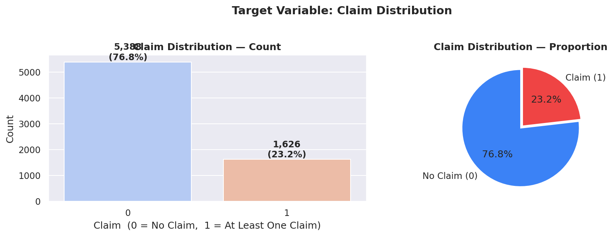
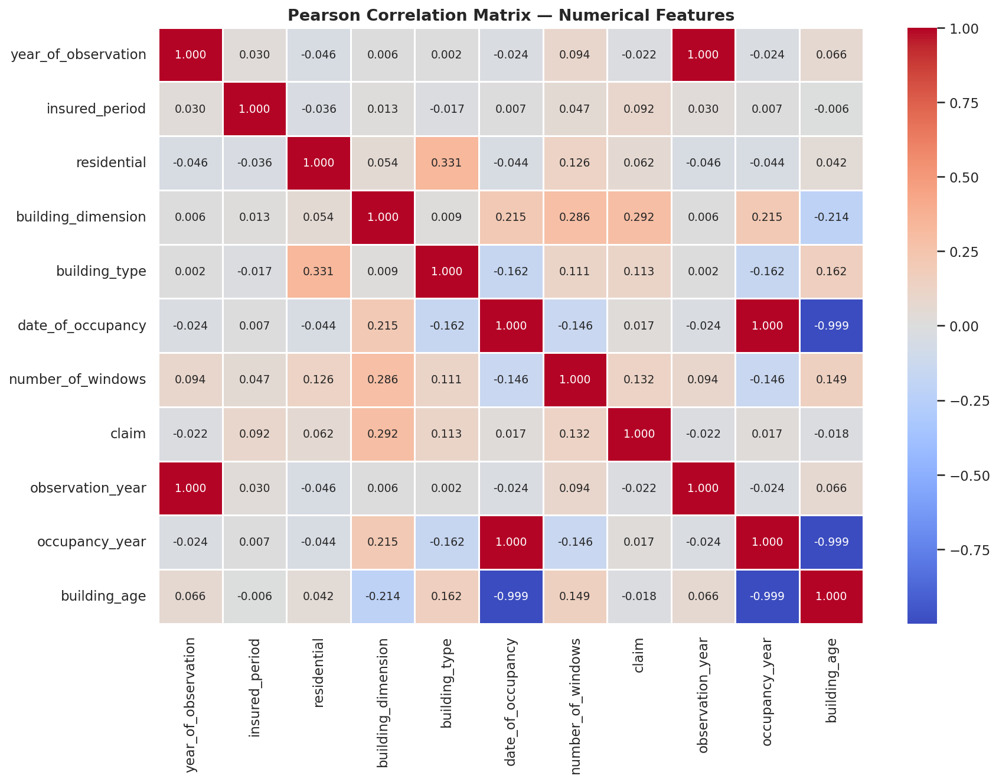
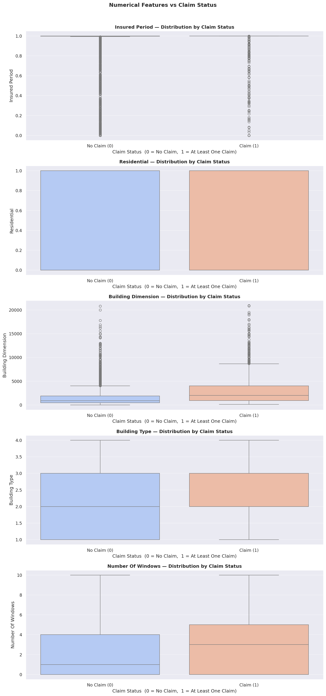
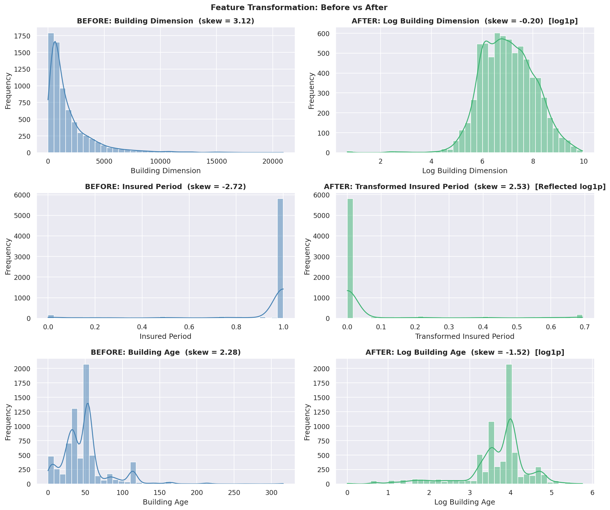
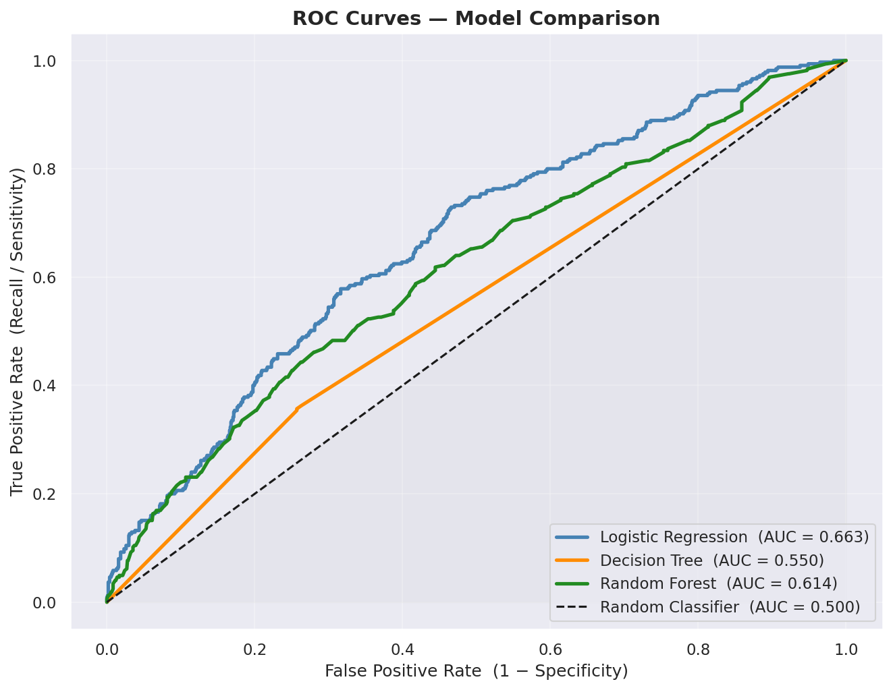
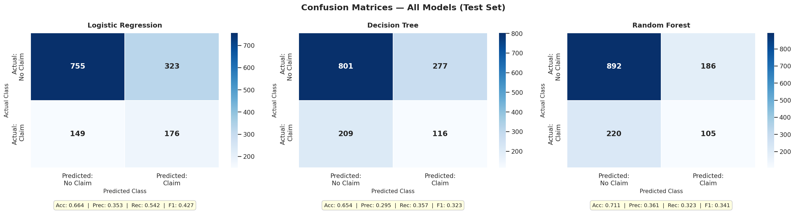
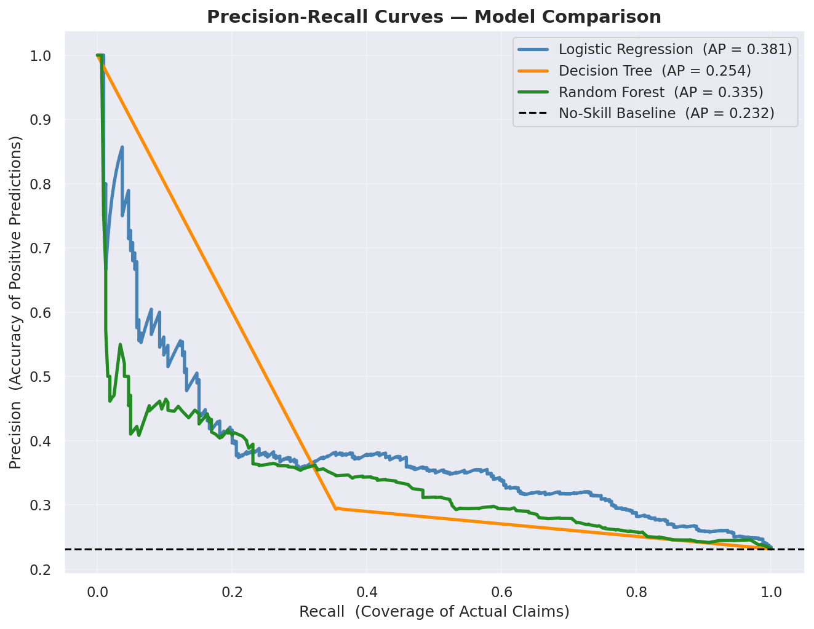
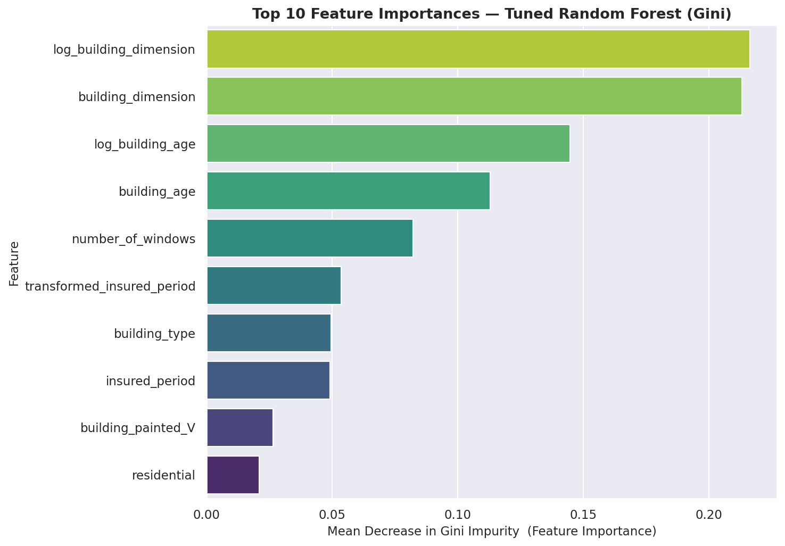
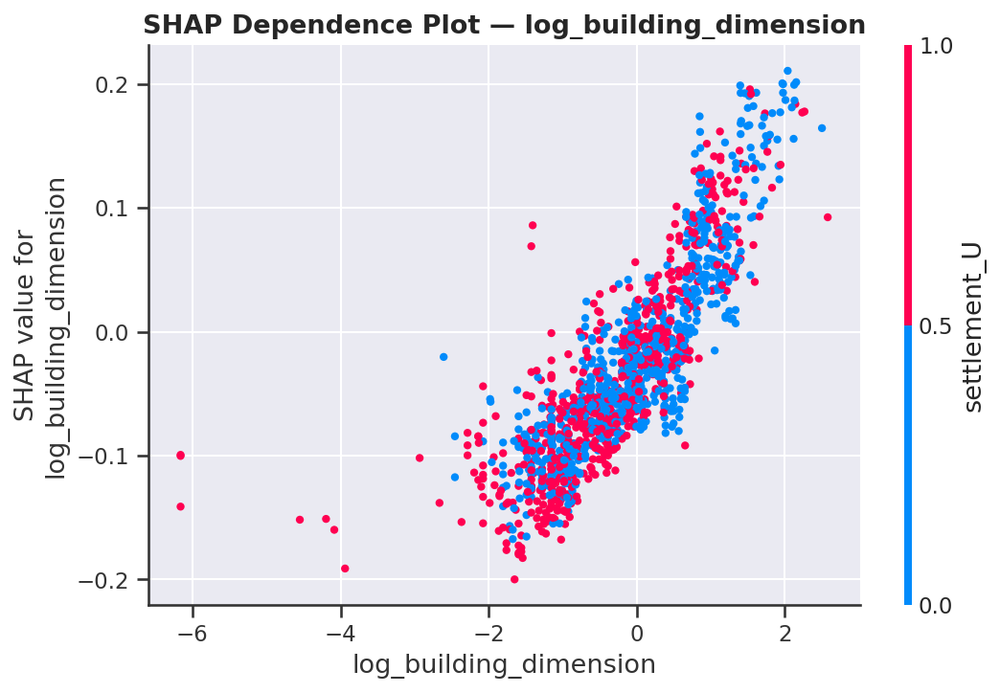

<div align="center">

# 🏛️ Building Insurance Claim Prediction

### An End-to-End Binary Classification Project

[](https://python.org)
[](https://scikit-learn.org)
[](https://streamlit.io)
[](https://jupyter.org)

[](https://github.com/cssadewale)
[](https://linkedin.com/in/adewalesamsonadeagbo)

</div>

---

## 📌 Project Overview

As the **Lead Data Analyst**, the task was to build a predictive model that determines whether a building will have an insurance claim during a given observation period, based on its structural and environmental characteristics.

**Target Variable — `claim`:**

| Value | Meaning |
|-------|---------|
| `1` | The building has **at least one claim** over the insured period |
| `0` | The building has **no claim** over the insured period |

The project covers the complete data science lifecycle — from raw data through cleaning, EDA, feature engineering, model training, hyperparameter tuning, SHAP interpretability, and a live deployed web application.

---

## 🗂️ Repository Structure

```
insurance-claim-prediction/
│
├── Insurance_Claim_Prediction.ipynb     ← Full end-to-end notebook (portfolio-ready)
├── app.py                               ← Streamlit web application
├── requirements.txt                     ← Python dependencies
├── README.md                            ← This file
│
└── assets/                              ← EDA and model visualisations
    ├── target_distribution.png
    ├── insured_period_distribution.png
    ├── building_dimension_distribution.png
    ├── number_of_windows_distribution.png
    ├── building_age_distribution.png
    ├── categorical_distributions.png
    ├── correlation_heatmap.png
    ├── numerical_vs_claim.png
    ├── categorical_vs_claim.png
    ├── transformations_before_after.png
    ├── confusion_matrices.png
    ├── roc_curves.png
    ├── precision_recall_curves.png
    ├── feature_importance_rf.png
    ├── shap_summary_dot.png
    ├── shap_summary_bar.png
    ├── shap_dependence.png
    └── shap_waterfall.png
```

> 📦 **Note on model file:** `best_random_forest_model.joblib` exceeds GitHub's 25 MB file limit and is hosted on Google Drive. The Streamlit app downloads it automatically on first launch — no manual action required.

---

## 🔄 Project Workflow

| Step | Phase | What Was Done |
|------|-------|---------------|
| **1** | Basic Data Exploration | Loaded 7,160 records × 14 columns; cleaned `number_of_windows` in 3 sequential steps; imputed 3 missing-value columns using mode; removed 146 duplicate rows |
| **2** | Exploratory Data Analysis | Full univariate, bivariate, and multivariate analysis; confirmed 3.3:1 class imbalance; identified `building_dimension` as top predictor; confirmed triple redundancy of fenced/garden/settlement |
| **3** | Feature Engineering | Engineered `building_age`; applied `log1p` and reflected `log1p` transformations to 3 skewed features; one-hot encoded 4 categorical features |
| **4** | Data Preprocessing | 80/20 stratified split → SMOTE on training data only (5,611 → 8,620 samples) → StandardScaler (fit on training, applied to both sets) |
| **5** | Model Development | Trained 3 models; compared all metrics; tuned Random Forest with GridSearchCV (216 configs × 5 folds = 1,080 fits); validated with 5-fold cross-validation; interpreted with SHAP |
| **6** | Business Insights | 6 actionable recommendations covering risk pricing, tiered inspection, and portfolio management |

---

## 📊 Key EDA Findings

<div align="center">

### Target Variable Distribution


### Correlation Heatmap — Numerical Features


### Numerical Features vs Claim Status


### Feature Transformation — Before vs After


</div>

**Summary of critical findings:**

- **Class imbalance:** 76.82% No Claim vs 23.18% Claim (3.3:1 ratio) — a naïve always-predict-0 classifier achieves 76.82% accuracy by default. Addressed with SMOTE on training data only.
- **Top predictor:** `building_dimension` — claim buildings have a median size **2.2× larger** (1,995 m² vs 900 m²)
- **Second predictor:** `building_age` — older buildings claim more frequently due to accumulated wear and material degradation
- **Window signal:** Claim buildings have a median of **3 windows** vs 1 for non-claim buildings — a 3× difference
- **Urban/rural redundancy:** `building_fenced`, `garden`, and `settlement` are near-perfectly correlated — all encode the same underlying urban/rural risk signal, not three independent signals
- **Building type gradient:** Type 4 → highest claim rate; Type 1 → lowest — consistent across all analyses

---

## 🤖 Model Performance

<div align="center">

### ROC Curves — All Models


### Confusion Matrices — All Models


### Precision-Recall Curves


</div>

### Test Set Metrics

| Model | Accuracy | Precision | Recall | F1-Score | ROC-AUC |
|-------|----------|-----------|--------|----------|---------|
| Logistic Regression | 0.6636 | 0.3527 | 0.5415 | 0.4272 | 0.6629 |
| Decision Tree | 0.6536 | 0.2952 | 0.3569 | 0.3231 | 0.5498 |
| **Tuned Random Forest ✅** | **0.7106** | **0.3608** | 0.3231 | 0.3409 | 0.6144 |

> ⚠️ **Why accuracy is not the primary metric:** A naïve classifier that always predicts "No Claim" achieves **76.82% accuracy** without learning a single pattern. We rely on Precision, Recall, F1-Score, and ROC-AUC throughout.

**5-Fold Cross-Validation (tuned model on training distribution):** Mean F1 = **0.7921 ± 0.1063**

**Best hyperparameters (GridSearchCV):**
```
n_estimators      : 200
max_depth         : 20
max_features      : sqrt
min_samples_split : 2
min_samples_leaf  : 1
```

---

## 🎯 Feature Importance & SHAP Analysis

<div align="center">

### Random Forest Feature Importance (Gini)


### SHAP Summary — Beeswarm Plot


### SHAP Summary — Global Bar Plot


### SHAP Dependence Plot (Top Feature)


</div>

| Rank | Feature | Importance | Cumulative |
|------|---------|-----------|-----------|
| 1 | `log_building_dimension` | 0.2164 | 21.64% |
| 2 | `building_dimension` | 0.2131 | 42.95% |
| 3 | `log_building_age` | 0.1448 | 57.43% |
| 4 | `building_age` | 0.1130 | 68.73% |
| 5 | `number_of_windows` | 0.0822 | 75.95% |

Building size and age together account for **68.73%** of the model's decision-making. SHAP confirms the direction — high building dimension and high building age both push predictions toward Claim (1).

---

## 🛠️ Tech Stack

| Category | Tools |
|----------|-------|
| Data manipulation | `pandas`, `numpy` |
| Visualisation | `matplotlib`, `seaborn` |
| Machine learning | `scikit-learn` |
| Imbalanced data | `imbalanced-learn` (SMOTE) |
| Interpretability | `shap` |
| Automated EDA | `ydata-profiling` |
| Model serialisation | `joblib` |
| Model hosting | Google Drive (via `gdown`) |
| Web application | `streamlit` |

---

## 🚀 Running the Streamlit App

### Option A — Live App

👉 **[Open the live app on Streamlit Cloud](https://YOUR-APP-LINK.streamlit.app)**

> Replace the link above with your deployed Streamlit URL.

---

### Option B — Run Locally

```bash
# 1. Clone the repository
git clone https://github.com/cssadewale/insurance-claim-prediction.git
cd insurance-claim-prediction

# 2. Create and activate a virtual environment
python -m venv venv
source venv/bin/activate          # macOS / Linux
venv\Scripts\activate             # Windows

# 3. Install all dependencies
pip install -r requirements.txt

# 4. Launch the app
streamlit run app.py
```

The app opens at `http://localhost:8501`. The trained model downloads automatically from Google Drive on first launch.

---

## 📓 Running the Notebook

The notebook is self-contained and designed for **Google Colab** — all datasets are downloaded automatically via `gdown`.

1. Open `Insurance_Claim_Prediction.ipynb` in Google Colab
2. Click **Runtime → Run all**
3. No manual file uploads needed

---

## 📈 Feature Engineering Summary

| Original Feature | Transformation Applied | New Feature | Skewness Change |
|-----------------|----------------------|-------------|----------------|
| `building_dimension` | `log1p(x)` | `log_building_dimension` | +3.12 → −0.20 |
| `insured_period` | `log1p(1 − x)` (reflected) | `transformed_insured_period` | −2.72 (left-skewed) |
| `building_age` | `log1p(x)` | `log_building_age` | +2.28 → −1.52 |
| `year_of_observation`, `date_of_occupancy` | Subtraction | `building_age` | New derived feature; originals dropped |
| 4 categorical columns | One-Hot Encoding (`drop_first=True`) | 4 binary dummy columns | Required for ML models |

---

## 💼 Business Recommendations

| # | Recommendation | Action |
|---|---------------|--------|
| 1 | **Risk-Based Premium Pricing** | Use `building_dimension`, `building_age`, and `number_of_windows` as primary rating factors |
| 2 | **Tiered Risk Classification** | Type 4 & 3 → high-risk (mandatory inspection). Type 1 → preferential pricing |
| 3 | **Targeted Pre-Renewal Inspections** | Flag buildings scoring > 60% claim probability before renewal |
| 4 | **Residential Portfolio Review** | Dedicated actuarial review — residential buildings claim at a higher rate |
| 5 | **Maintenance Incentive Programme** | Premium discounts for verified maintenance records at renewal |
| 6 | **Early Warning at New Business** | Integrate model into application workflow — refer high-risk applicants for manual review |

---

## ⚠️ Limitations & Next Steps

| Limitation | Impact | Mitigation |
|-----------|--------|-----------|
| Geographic granularity lost | `geo_code` dropped — location risk unaccounted for | Enrich with geocoded risk scores |
| Claims severity not modelled | Predicts occurrence, not cost | Companion regression model for claim amount |
| Temporal drift | Dataset covers 2012–2016 only | Annual retraining with drift monitoring |
| Binary target | Minor and major claims both = 1 | Multi-class or severity-weighted target |

---

## 👤 Author

<div align="center">

**Adewale Samson Adeagbo**

*Educator · Data Practitioner*

*Learning deliberately. Teaching authentically.*

[](https://github.com/cssadewale)
&nbsp;
[](https://linkedin.com/in/adewalesamsonadeagbo)

| | |
|---|---|
| 🎓 **Education** | B.Sc.(Ed) Computer Science Education — Lagos State University (2023) |
| 📚 **Teaching** | Mathematics, Further Mathematics, Chemistry, Physics — 10+ years, Lagos & Ogun State, Nigeria |
| 🏢 **Organisation** | HMG Concepts (His Marvellous Grace Educational Consult) — Visioner & Data Lead since 2015 |
| 🛠️ **Stack** | Python · Scikit-learn · Pandas · SHAP · SQL · Power BI · Tableau · Streamlit |

</div>

---

## 📄 License

This project is open source and available under the [MIT License](LICENSE).

---

<div align="center">

*Built with 🧠 data science precision and 📐 mathematical rigour*

</div>
